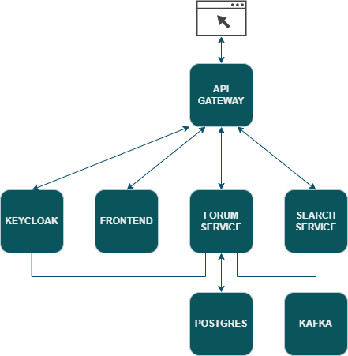
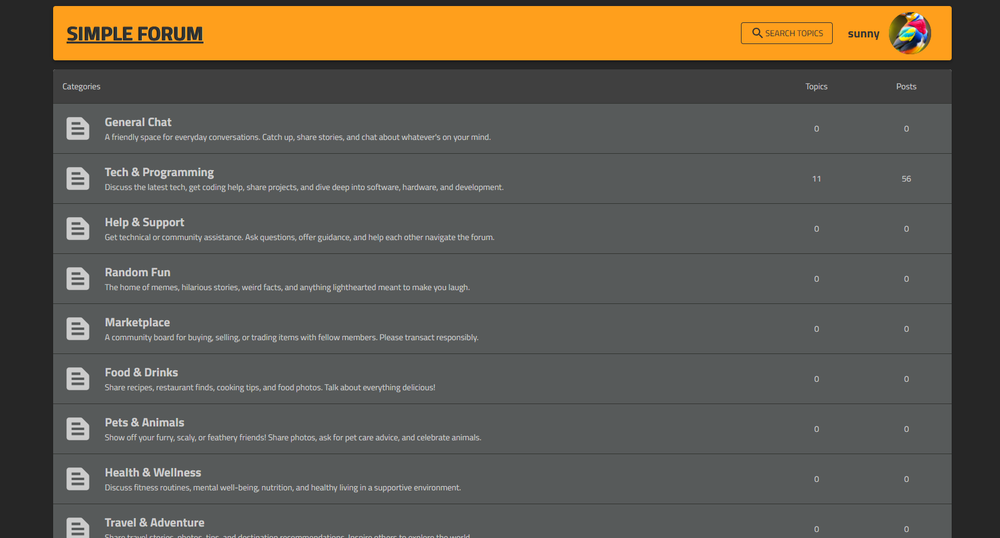
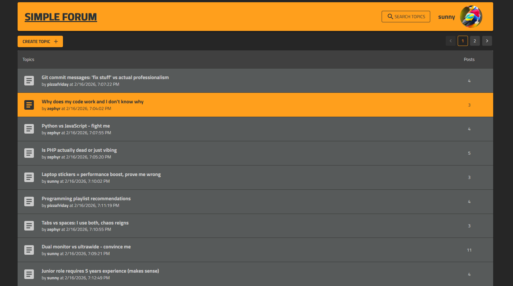
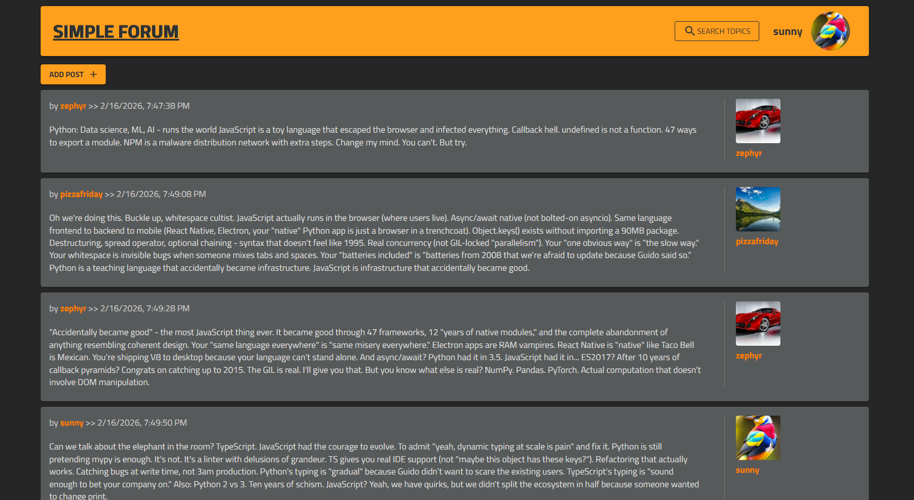

# Simple Forum

A lightweight forum application built as a learning project to explore web development fundamentals. Users can create
topics, engage in discussions, and explore different categories.

🔗 **Live Demo:
** [https://alex-pash.ddns.net/simple-forum/ui/categories](https://alex-pash.ddns.net/simple-forum/ui/categories)

## 🎯 Purpose

This project was created to gain hands-on experience with enterprise-grade technologies and patterns:

- Full-stack web application architecture
- Building scalable REST APIs with Spring ecosystem
- Implementing secure authentication with JWT and Spring Security
- Working with event-driven architecture using Kafka
- Full-text search implementation with Elasticsearch
- Service discovery and configuration management with Consul
- Database design and relationships
- Database versioning and migration strategies
- Deployment and server configuration

## ✨ Features

- **Category-based Organization** – Browse discussions by topic areas
- **Thread Creation** – Start new conversations within categories
- **User Authentication** – Secure registration and login system

## 🛠️ Tech Stack

### Frontend

- **React** – Component-based UI library
- **Material-UI (MUI)** – Modern React component framework

### Backend

- **Spring Boot** – Application framework
- **Spring Data JPA** – Data persistence layer
- **Spring Security** – Authentication and authorization
- **KeyCloak** – Identity and access management
- **PostgreSQL** – Primary relational database
- **Apache Kafka** – Event streaming platform
- **Elasticsearch** – Distributed search and analytics engine
- **HashiCorp Consul** – Service discovery and configuration
- **MapStruct** – Compile-time code generator for bean mappings
- **Lombok** – Boilerplate code reduction
- **Flyway** – Database migration tool

## 🏗️ Architecture

## 📸 Screenshots

### Categories Page

### Topics Page

### Thread Discussion

